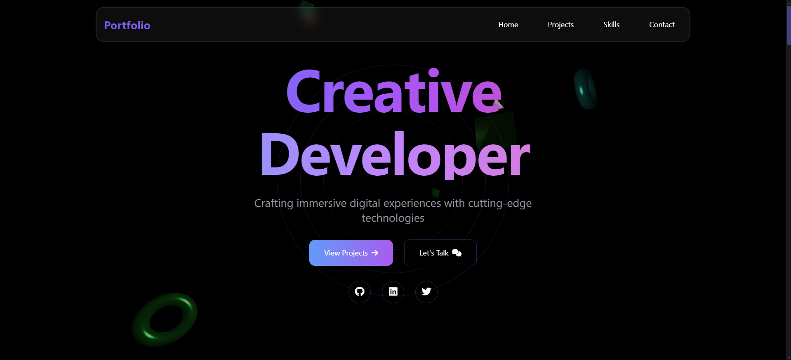

# Modern Portfolio Website

A modern, responsive portfolio website built with HTML, Tailwind CSS, Three.js, and GSAP.



## 🌟 Features

- **Modern Design**: Clean and modern UI with glass morphism effects
- **Responsive**: Fully responsive design that works on all devices
- **3D Elements**: Interactive 3D background using Three.js
- **Smooth Animations**: Engaging animations powered by GSAP
- **Performance Optimized**: Fast loading and smooth performance
- **Cross-Browser Compatible**: Works on all modern browsers

## 🛠️ Technologies Used

- HTML5
- Tailwind CSS
- JavaScript
- Three.js
- GSAP (GreenSock Animation Platform)
- Font Awesome Icons

## 📋 Sections

- Dynamic Hero Section
- Featured Projects
- Services
- Technologies/Skills
- Journey/Timeline
- Testimonials
- Contact Form
- Footer

## 🚀 Getting Started

1. Clone the repository:
```bash
git clone https://github.com/M7mdJs/3D-Portfolio.git
```

2. Run:
```bash
Click on the index.html file
```

## 📁 Project Structure

```
3D-Portfolio/
├── index.html
├── style.css
├── main.js
```

## 🎨 Customization

1. **Colors**: Edit the Tailwind configuration file to change the color scheme
2. **Content**: Update the content in index.html
3. **3D Elements**: Modify three-background.js to change 3D elements
4. **Animations**: Adjust GSAP animations in main.js

## 📱 Responsive Design

- Mobile-first approach
- Breakpoints:
  - Mobile: < 768px
  - Tablet: 768px - 1024px
  - Desktop: > 1024px

## ⚡ Performance

- Optimized images
- Lazy loading
- Minified assets
- Efficient animations

## 🔧 Browser Support

- Chrome (latest)
- Firefox (latest)
- Safari (latest)
- Edge (latest)

## 📄 License

This project is licensed under the MIT License - see the [LICENSE](LICENSE) file for details.

## 👤 Author

M7md.Js
- Website: [m7mjs.pages.dev](https://m7mjs.pages.dev/)
- GitHub: [@M7mdJs](https://github.com/M7mdJs)
- Discord: [_9z.](https://discord.com/users/1091118468155314306)

## 🤝 Contributing

1. Fork the repository
2. Create your feature branch (`git checkout -b feature/AmazingFeature`)
3. Commit your changes (`git commit -m 'Add some AmazingFeature'`)
4. Push to the branch (`git push origin feature/AmazingFeature`)
5. Open a Pull Request

## 💫 Acknowledgments

- Three.js documentation and community
- Tailwind CSS team
- GSAP team
- Font Awesome

---
Made with ❤️ by [M7md.Js](https://github.com/M7mdJs)
"# Portfolio" 
